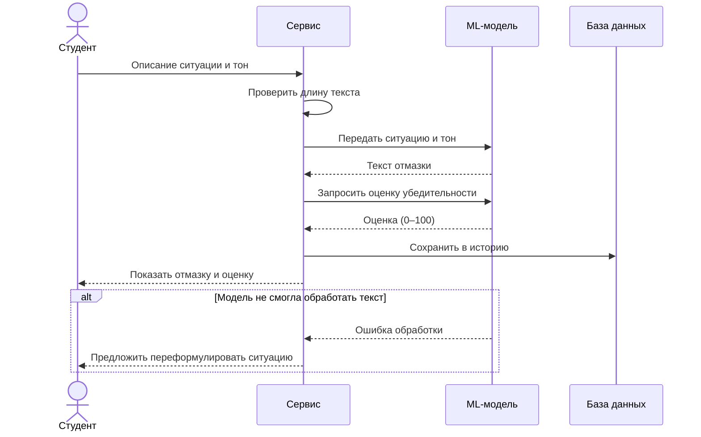
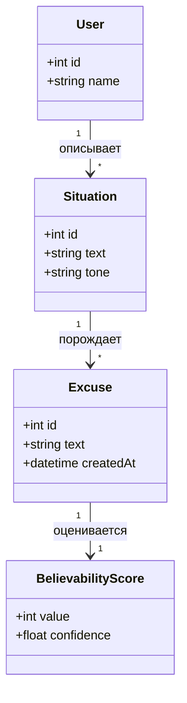

# Диаграммы

## Диаграмма последовательности

Сценарий UC-01 «Генерация отмазки».

```mermaid
sequenceDiagram
    actor User as Студент
    participant App as Сервис
    participant Model as ML-модель
    participant DB as База данных

    User->>App: Описание ситуации и тон
    App->>App: Проверить длину текста
    App->>Model: Передать ситуацию и тон
    Model-->>App: Текст отмазки
    App->>Model: Запросить оценку убедительности
    Model-->>App: Оценка (0–100)
    App->>DB: Сохранить в историю
    App-->>User: Показать отмазку и оценку

    alt Модель не смогла обработать текст
        Model-->>App: Ошибка обработки
        App-->>User: Предложить переформулировать ситуацию
    end
```

## Диаграмма классов

```mermaid
classDiagram
    class User {
        +int id
        +string name
    }

    class Situation {
        +int id
        +string text
        +string tone
    }

    class Excuse {
        +int id
        +string text
        +datetime createdAt
    }

    class BelievabilityScore {
        +int value
        +float confidence
    }

    User "1" --> "*" Situation : описывает
    Situation "1" --> "*" Excuse : порождает
    Excuse "1" --> "1" BelievabilityScore : оценивается
```
